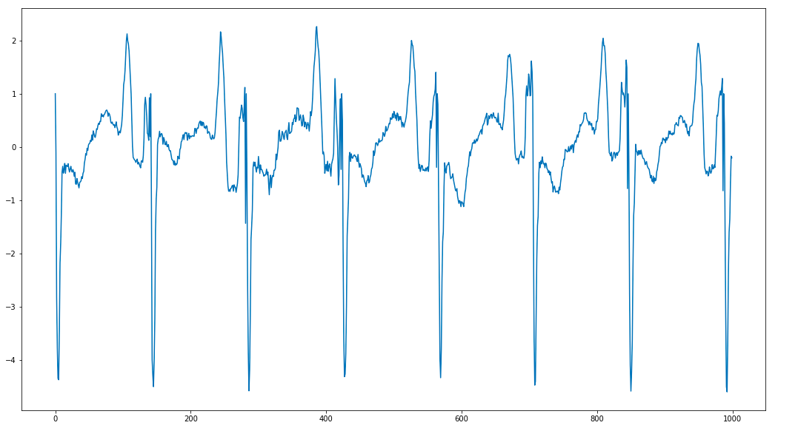
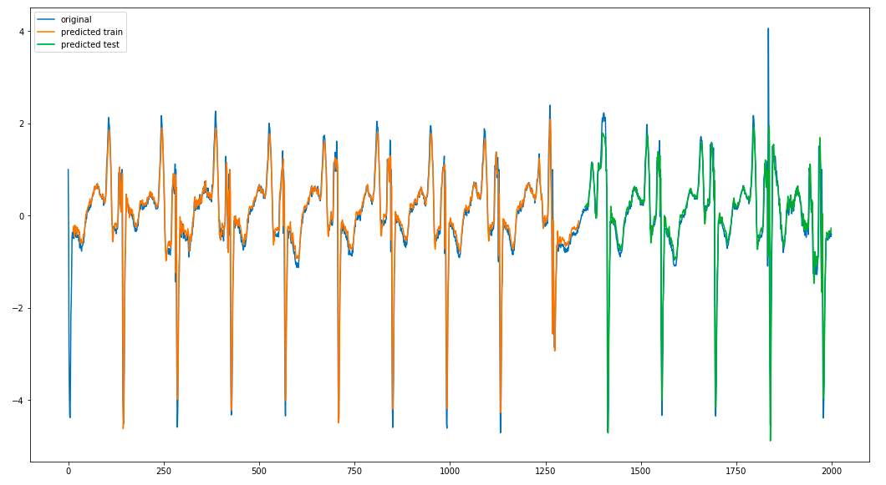

# LSTM for time series forecasting

In this repository I will implement a LSTM architecture for time series forecasting. We used heartbeat records as dataset.
 

## Requirements

Pandas 0.24.2
 
Matplotlib 3.0.3
 
Numpy 1.16.5
 
Keras 2.2.5
 

## Data
The dataset can be found [here](http://www.timeseriesclassification.com/description.php?Dataset=ECG5000).
 
All data used are under /dataset folder in the main repo.
  
Here is a visualisation of small sample from the used data.
 
 

  

## Results
With only 2 layers of LSTMs (10 units each) we got a quite good results.
 

  

 
The code and the dataset file are availables. 
 
Feel free to contact me for any question.
